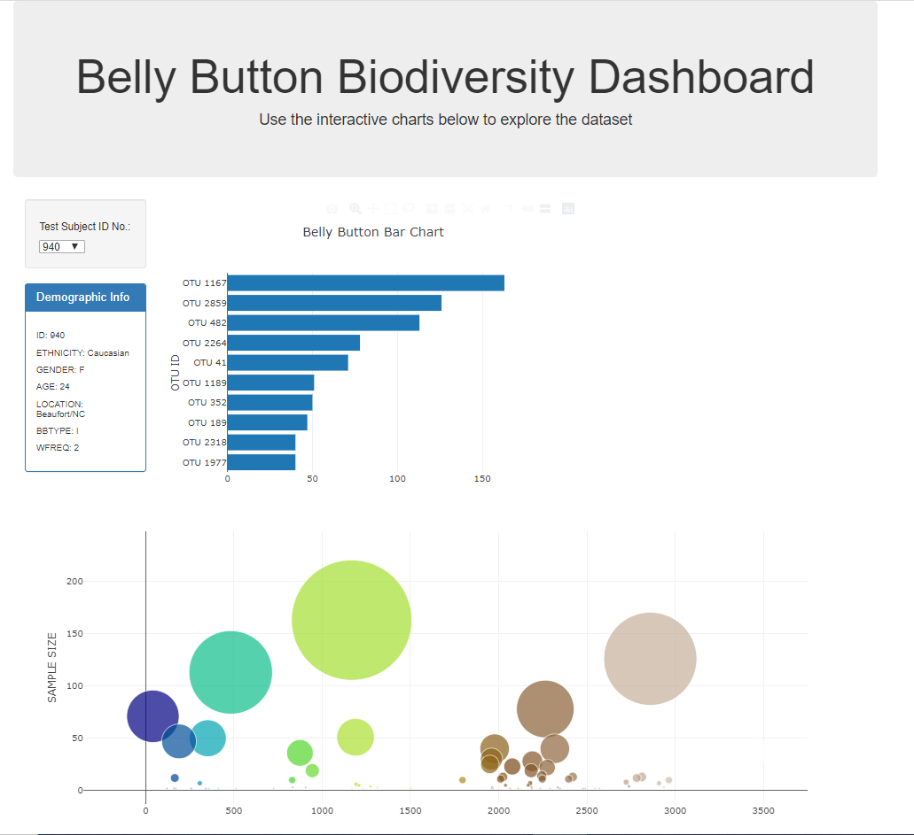
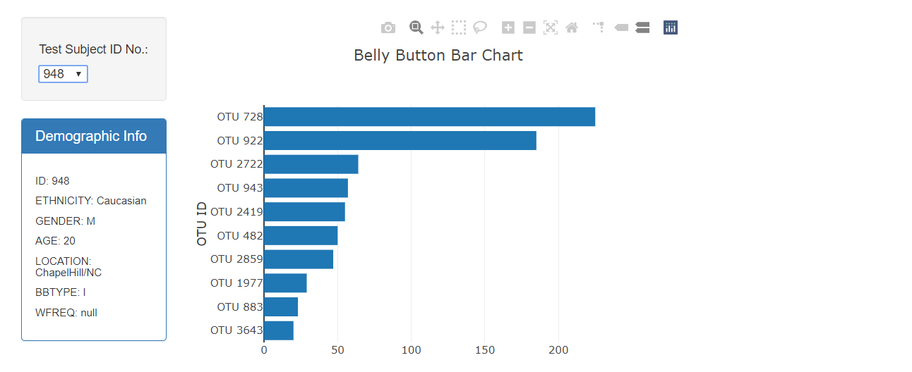
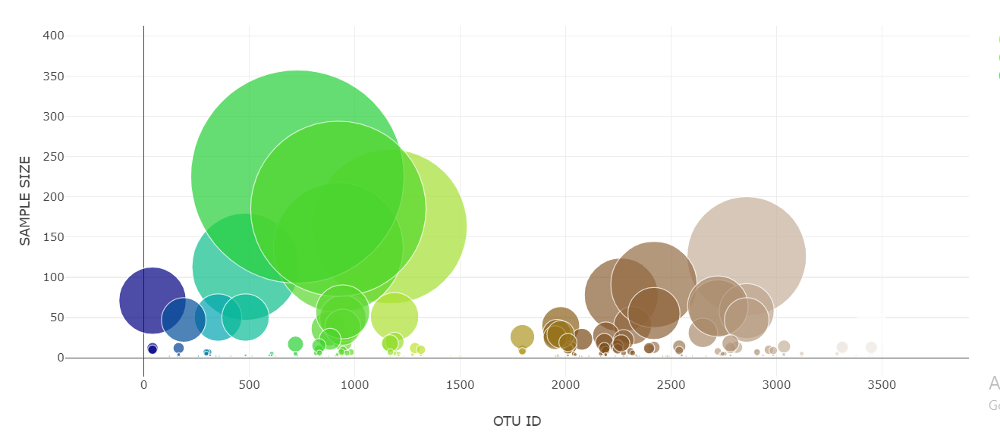

# BellyBiodiversity
## Project Github Page:
[Belly Button Diversity](https://varshajha28.github.io/BellyBiodiversity/)
## Project Overview
The project requires us to build an interactive dashboard to show the various charts to show the sample size based on the otu_ids. It provides the user to select the test user id via a dropdown menu and show the demographic information, the bar chart of the top ten otu_ids and the bubble chart for the sample -size based on the otu_ids. The hover over provides the names of the respective Otu_lables.
## Resources
- Data Source: sample.json
- Software: Plotly.js,Bootstrap,D3.js,Javascript and Html.
 ## Belly Button Dashboard :
The Belly Button Dash board shows the interactive charts which is hosted via github page .

## Challenge Overview
The challenge's objective was to build the interactive bar charts which shows the top otu_ids for the selected Test samples.It also requires us to create a bubble chart for the selected Test ids.
## Challenge Summary
The Belly Biodiversity dashboard shows the bar chart and demographic info of the Test sample id **948**

The Belly Biodiversity dashboard shows the bubble chart for the Test sample id :**948**

